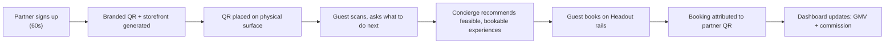
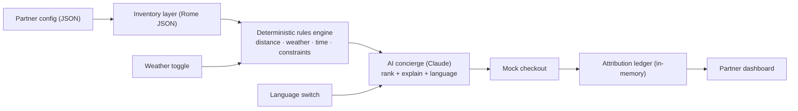

# Headout Here — Hackin '26 Master Doc

> Single source of truth for building **Headout Here** at Hackin '26.
> Replaces the earlier Launchpad brief, GTM plan, and handoff docs.
> Last updated: 2026-06-18 · Team size: 3 · Stack: Replit · Data: polished mock (Rome)

---

## Table of Contents

**Part A — Orient**
1. TL;DR & Pitch
2. Hackathon Reality Check
3. The Idea, Sharpened

**Part B — Win**
4. Prize Positioning
5. The Field & Our Edge

**Part C — Build**
6. Scope & Cut Lines
7. Product Spec
8. Technical Architecture
9. Seed Data (Rome)
10. The 42-Hour Plan

**Part D — Sell**
11. Live Demo Script
12. Trailer Plan
13. Pitch & Q&A Prep

**Appendix**
14. Economics (Rome)
15. GTM (Compressed)
16. Open Decisions & Status

---

# Part A — Orient

## 1. TL;DR & Pitch

**One-liner:**
> **Headout Here turns *any* trusted physical place — a hotel desk, a café, a lounge, a venue, a tourist desk, a short-stay host, a coworking space — into a Headout-powered experiences storefront. Guests scan a Headout-branded QR, ask what to do next, book on Headout rails, and the place earns a cut of every QR-attributed booking.**

**It's two things at once (both pillars matter equally):**
- **Distribution** — a new, low-CAC channel that captures *physical* demand at the moment of intent and pays the place that owns the surface, instead of paying an ad platform.
- **Brand** — Headout-branded QRs on trusted surfaces all over a city. Headout becomes ambient — the recognizable answer to "what should we do next?" in the real world, not just an app you remember to open. Every QR is a measurable offline billboard.

**What it is, in three sentences:**
1. Every day travelers ask "what should we do next?" in physical places that have trust and footfall but no inventory, checkout, or fulfillment.
2. Headout Here gives any such place a Headout-branded QR concierge: the guest scans, asks in their own language, gets feasible/bookable Headout experiences (location-, time-, and weather-aware), and books.
3. Every QR is attributed, so the place earns commission — making Headout a new physical distribution network *and* an everywhere brand at the moment of intent.

**Target prizes:** 📈 **Move the Needle** (primary — new distribution channel + brand surface) + ⭐ **Five Stars** (secondary — the guest concierge delight). See §4.

**The demo in one breath:** A place — *pick any; we'll use one as an example* — signs up in 60 seconds → gets a Headout-branded QR → a judge scans it → asks "it's raining and I have a 6-year-old, what can we do this afternoon?" → gets 3 indoor, nearby, family-friendly, bookable picks → books one → the place's dashboard updates with GMV and commission live → we flip the place type (café, lounge, venue, tourist desk) and the same engine re-skins instantly — same Headout brand, any surface.

---

## 2. Hackathon Reality Check

**The clock — this is live now.**
- **Build window: Thu 18 June 6:00 PM IST → Sat 20 June 12:00 PM (noon) IST ≈ 42 hours.**
- **Hard rule: code only inside the window.** Planning/ideas before is fine (that's this doc). Any pre-built code = **instant disqualification**. Start the repo *after* kickoff.

**What we must submit (3 things — your old docs only planned 1):**
1. **A live demo** of the working tool (strongly recommended to run live on the final day).
2. **A 2–3 minute recording** of that live demo (backup if the live run stumbles; required for remote teams).
3. **A trailer / hype reel** — Hackin '26 explicitly expects every team to ship a trailer *and* a demo video. This is graded storytelling, not optional polish. (See §12.)

**Judging:** No tracks. Build anything that matters to Headout. After demos, **every hack is considered for every award** — you don't pick a category, the category finds you. Five categories (§4). **$500 per person** on each winning team.

**Sanctioned tools & credits:**
- **Replit** — sponsored, **unlimited credits for these 2 days**, out-of-the-box (our stack).
- **Claude / Codex** — limits bumped way up; use for coding + the concierge LLM calls.
- **fal** — sponsored credits for video/trailer generation.
- **Product OS** (`product-os.headout.com`) + **Porygon MCP** — internal knowledge base for research/PRD/validation; an extra "teammate."
- **Specialized/paid tools (e.g. ElevenLabs for VO)** — available on request; ping the AI mentors.

**Data:** Everything except PII is fair game; most lives in **BigQuery** (access via the data team). *We are deliberately using polished mock data (§9) — real data is a stretch goal only (§6), not a dependency.*

**Mentors to pull on (they're volunteering on top of their own hacks — bring context):**
- **Product:** Atish, Aditya Kulkarni
- **Engg + AI:** Neel, Sumit, Aakash, Rachit, Yuvraj
- **Data:** Mrinalini, Harshita
- **Design:** Ramakrishna V
- **Storytelling/GTM:** Gaurav Bisen (ran the GTM session) — channel his framing into the pitch.

**Key channels:** `#event-hackin-2026` (logistics) · `#event-hackin-2026-ideas` (idea board / claims).

---

## 3. The Idea, Sharpened

**The insight.** Headout already owns the hard parts of selling experiences — global inventory, availability, pricing, checkout, payments, fulfillment, support, refunds, supplier relationships. What it doesn't own is the **physical moment of intent**, and that moment happens in *every kind of place*: a hotel lobby, a café, a dinner table, a lounge during a delay, a venue after the show, a hostel common room, a short-stay check-in, a coworking lounge, a tourist desk, a mall concierge. Any place with footfall and a "what should we do next?" moment qualifies. These surfaces have trust and footfall but no experiences infrastructure. Headout Here bolts the two together — and is deliberately **place-agnostic**: hotels are a convenient example, never the boundary.

**The product loop:**



**The second pillar — brand.** Don't let anyone reduce this to a booking funnel. Every Headout Here QR is a Headout-branded object on a trusted physical surface — a small, measurable billboard. Put thousands of them across a city's hotels, cafés, lounges, and desks and Headout stops being "an app you open" and becomes **ambient**: the brand travelers see, and trust, exactly when they're deciding what to do. Distribution earns the booking; brand earns the next one, direct. Both pillars are first-class.

**Why this is NOT "just another AI concierge" (read this before every judge conversation).**
There are already 3–4 concierge/travel-assistant hacks in the room (§5), all of them consumer-direct chatbots on a phone. Headout Here is a different *kind* of thing: it's a **B2B2C distribution channel with a physical surface and attributed economics**. The concierge is one feature inside it. The product is: *a new low-CAC channel that pays the owner of the physical surface a cut, and puts the Headout brand on the wall where the question is actually asked.* Better chat is a feature; a new channel is a needle-mover. We compete on the second.

---

# Part B — Win

## 4. Prize Positioning

You don't pick a category, but you *aim* the story. Aim here:

| Category | Fit | How we tell it |
|---|---|---|
| 📈 **Move the Needle** | **PRIMARY** | New revenue stream + new physical distribution channel + brand-positioning play. "Roadmap rock nobody's moved," structural bet. This is the home category. |
| ⭐ **Five Stars** | **SECONDARY** | The guest-facing concierge that gives a genuinely better answer than a brochure rack — multilingual, weather-aware, bookable in two taps. Carried by the live demo. |
| 🎟️ Partner Pass | *Not our category* | This is for **supply partners** (operators who run experiences). Hotels/restaurants are **distribution** partners, not supply. Don't frame it here — that lane belongs to SupplyLens/Benevolent/SP-growth hacks. |
| 🗼 Mission Control | No | Internal systems/tooling — not us. |
| 💻 Root Access | No | Deep-stack/infra — not us. |

**The strategic one-liner for judges:**
> "Headout spends to acquire traffic online. Headout Here acquires *physical* demand at the moment of intent — from any trusted place, not just hotels — and pays that place a commission instead of paying an ad platform. Two wins in one: a new low-CAC channel, and a Headout-branded surface in the real world. Measurable down to GMV *and* brand impressions per QR."

**The numbers (see §14):** base-case Rome maturity models to **~€22M incremental GMV/yr** at a **~7% effective CAC** and **~89M Headout brand impressions/yr** — from a single city. Each partner watches its own slice live on its dashboard.

---

## 5. The Field & Our Edge

**Live on the idea board (concierge / travel-adjacent):**

| Hack | What it is | Surface | Why we're different |
|---|---|---|---|
| **Headout In-Trip Concierge** | WhatsApp AI: itinerary + booking + restaurant reservations during a trip | Consumer phone (WhatsApp) | Direct-to-consumer. No partner, no physical surface, no attributed commission, no new channel. |
| **Travel Copilot** | Remembers your planning, surfaces what you need during the trip | Consumer app | Personal assistant, not distribution. |
| **Day of the Experience** | WhatsApp day-of support + nearby add-ons for *already-booked* guests | Consumer phone | Post-booking support; we're pre-booking demand capture at a physical surface. |
| **Disruption Recovery Concierge** | Rebook alternatives when an SP cancels | Internal/recovery flow | Salvage funnel; different moment. |

**Our edge, in one line:**
> Every other concierge sells to the traveler through the phone they already own. **Headout Here puts the Headout brand on the wall, the table, and the front desk — anywhere there's footfall — and pays whoever owns that surface.** They built better chat. We built a new channel *and* an everywhere brand.

**The trap to avoid:** if a judge mentally files us under "AI concierge," we lose to whoever has the slickest chat. So the demo and pitch must foreground the **partner dashboard, the commission counter, the QR attribution, and the partner-type switch** — the things no consumer chatbot has. Lead with the channel, not the chat.

**No collision:** nobody has claimed the physical-partner-QR-distribution wedge. It's ours.

---

# Part C — Build

## 6. Scope & Cut Lines

**The one loop we build (and nothing else):**
> Partner signup → generated QR + storefront → guest concierge → recommendation → mock checkout → QR-attributed commission dashboard → partner-type switch.

**Build for real:**
- Partner setup form
- Generated guest storefront (mobile-first) + working QR code
- AI concierge over the Rome inventory JSON (deterministic filter → AI explanation)
- Mock "book" action that emits a real booking event
- Partner dashboard that updates live (scans, chats, bookings, GMV, commission)
- Place-type switcher (hotel → café → lounge → venue → tourist desk re-skin — proves it's place-agnostic)
- Weather toggle + language switch (both are demo superpowers — cheap to build, huge on stage)

**Fake cleanly (and say so if asked):**
- Real payment / real ticket fulfillment / real partner auth
- Real commission settlement / payouts
- Live inventory API / multi-city supply
- Real attribution windows (we hardcode same-session for the demo)

**Explicit non-goals (do not build):**
- More than one fully-built place type (the others are *re-skins* of the same engine, not separate builds)
- More than one city
- Accounts, login, persistence beyond the demo session
- A real maps integration (distance is precomputed in the seed data)
- Real data / BigQuery (stretch only — see below)

**Stretch goals (only if demo-ready by Fri night):** swap a real Rome inventory slice from BigQuery behind the same interface; add a second language voice; print a physical QR stand for the room.

---

## 7. Product Spec

### Screens
1. **Place Setup** — form: place name, **place type (free-form with examples: hotel, café, hostel, lounge, venue, tourist desk, coworking, short-stay host, mall concierge, gym… — explicitly "any physical place")**, location, guest profile, languages, brand tone, logo/color, categories to highlight/avoid, commission %. CTA: **"Generate Headout Here."** The breadth of this one field *is* the place-agnostic promise — make it visible.
2. **Generated Output** — the **branded Headout QR** (see *The branded QR* below), storefront preview (phone frame), dashboard link, embed snippet, and a print-ready QR poster / table-tent. The "wow, in 60 seconds" beat — and the thing that drops out is unmistakably *Headout*, not a generic black-and-white square.
3. **Guest Storefront (mobile-first)** — **Headout-forward co-branded header: "{Place name} × Headout"** (Headout brand prominent — this is the brand pillar in pixels, not a tiny footer), an "Ask the concierge" input, and quick chips: `Today` · `Near me` · `Kid-friendly` · `Rainy day` · `Under 2 hrs` · `Tonight`.
4. **Concierge + Recommendations** — chat thread; each recommendation card shows the experience + **why it fits** (e.g. `Indoor ✓ · 700m ✓ · next slot 15:30 ✓ · family-friendly ✓`) + price + "Book."
5. **Mock Checkout → Confirmation** — handoff screen → ticket confirmation → "{Place} earns €X.XX on this booking" (e.g. Casa Aurelia earns €1.92).
6. **Partner Dashboard (the place's live scoreboard)** — three headline tiles, the three things every place cares about: **Impressions** (QR brand reach + measured scans — the reach they're giving Headout), **Conversions** (scan → chat → booking, with the booking rate), and **Commission** (earned to date + this month, with the next payout). Below: GMV, top experiences, top guest questions, language mix, and **performance by QR surface** (which placement earns most). Numbers animate up live the instant a booking lands. This is the per-place, real-time version of the model in §14 — every assumption there is a tile here.
7. **Place-Type Switcher** — toggle across place types (hotel → café → lounge → venue → tourist desk); header, copy, default chips, and CTA re-skin from the same config. Same Headout brand throughout — only the place context changes.

### The branded QR — make it unmistakably Headout

The QR is the product's most-photographed object and the brand pillar (§1) in physical form, so it can **never** be a plain black-and-white square. Every generated QR is:

- **Branded** — the Headout logo locked into the centre module; data modules in the **Headout brand colour** on a clean light field (high-contrast so it always scans). The co-brand frame reads **"{Place} × Headout."**
- **Thematic** — rounded "pill" modules and custom finder-eyes styled to the Headout mark, wrapped in a framed card: a headline (**"Need plans nearby? Scan for Headout picks"**), the place name, the **Headout wordmark + tagline**, and a light destination motif (e.g. a Rome skyline strip) so it reads *local*, not corporate.
- **A poster, not just a code** — the downloadable asset is a print-ready **table-tent / lobby stand**, not a bare PNG. This is the physical billboard from §1, actually designed.
- **Still scannable** — logo overlay ≤ ~20% of area, error-correction level **H**, tested on a real phone before the demo. *Cool must never cost a scan.*

Treat this as a first-class screen, not a `qrcode` default. Build path in §8.

### Concierge behavior — the golden rule
**Deterministic filters do the thinking; the LLM does the talking.**
- **Filters (code, not AI):** distance, indoor/outdoor vs. weather, duration vs. guest's time window, opening hours / next slot, kid/family/accessibility flags, `available_today`, category include/exclude.
- **AI (one grounded call):** takes the *filtered candidate set only*, ranks/selects 2–3, writes the conversational reply + the "why it fits" line, in the guest's language. **The AI never invents inventory and never does math.** This kills the #1 demo-killer: confidently recommending something that's closed, far, or sold out.

---

## 8. Technical Architecture

**Stack:** Replit · Next.js (App Router) single app · API routes for the concierge + booking · Tailwind for fast mobile UI · `qrcode` + a canvas overlay for the **branded** QR (§7) · Claude (via provided keys) for the concierge call. No external DB needed — seed JSON + in-memory session ledger is enough for the demo (optionally Replit DB / a JSON file for persistence).



**Data model (4 objects):**
- `place` — config (any place type; free-form `type`) that drives branding + defaults
- `experience` — inventory item with all the fields the filters need (precomputed `distance_m` per partner)
- `booking` — emitted on checkout, carries the attribution token
- `attribution` / ledger — aggregates bookings → dashboard metrics

**Attribution:** storefront URL carries `?place=casa-aurelia&surface=lobby`. That token rides through the session into the `booking` event → dashboard credits the place + surface. (Hardcode same-session; don't build real windows.)

**Branded QR (how):** generate the matrix with `qrcode` at error-correction level **H**, render to a `<canvas>`, recolour the modules to the Headout brand colour, round the module corners + paint the Headout-style finder-eyes, then composite the Headout logo in the centre (≤ 20% area). Wrap that in a poster component — `<BrandedQRPoster place={…} />` — that adds the co-brand frame, caption, place name, and Headout wordmark, and exports a print-ready PNG. ~1–2 hrs of Lane A polish on Fri night for an outsized stage payoff (it's the brand pillar people photograph).

**Concierge API contract (keep it this simple):**
`POST /api/concierge { partnerId, query, lang, weather }` → server runs filters → sends candidate set + guest query to Claude with a grounding prompt → returns `{ reply, recommendations[] }`. Recommendations reference only candidate IDs.

**Demo levers to wire early:** the **weather toggle** (sunny↔rain flips indoor filtering live) and the **language switch** are the two cheapest, highest-impact things on stage. Build them in.

---

## 9. Seed Data (Rome)

Build **30–50** experiences for realism; here's the representative core (expand around it). All distances are from Casa Aurelia (near the Vatican).

```json
// places.json — type is free-form; ANY physical place works.
// 3 varied examples so the place-type switcher has real targets.
[
  {
    "place_id": "casa-aurelia-rome", "name": "Casa Aurelia Rome", "type": "hotel",
    "address": "Via Germanico, Prati, Rome", "lat": 41.9070, "lng": 12.4560,
    "guest_profile": "international families and couples",
    "languages": ["English","Japanese","Hindi"],
    "brand_tone": "warm, premium, calm", "brand_color": "#1B4B5A",
    "highlight": ["museum","family","food"], "avoid": ["nightlife"],
    "default_chips": ["Today","Near me","Kid-friendly","Rainy day"],
    "commission_rate": 0.08
  },
  {
    "place_id": "caffe-prati", "name": "Caffè Prati", "type": "cafe",
    "address": "Via Cola di Rienzo, Prati, Rome", "lat": 41.9075, "lng": 12.4640,
    "guest_profile": "couples and friends, post-coffee planning",
    "languages": ["English","Italian"],
    "brand_tone": "casual, lively, local", "brand_color": "#B5651D",
    "highlight": ["food","walking-tour","nightlife"], "avoid": [],
    "default_chips": ["Tonight","After this","Near me","Under 2 hrs"],
    "commission_rate": 0.06
  },
  {
    "place_id": "prati-visitor-desk", "name": "Prati Visitor Desk", "type": "tourist-desk",
    "address": "Piazza del Risorgimento, Rome", "lat": 41.9069, "lng": 12.4570,
    "guest_profile": "walk-up tourists, all languages",
    "languages": ["English","Japanese","Hindi","Italian","Spanish"],
    "brand_tone": "helpful, neutral, multilingual", "brand_color": "#2E7D32",
    "highlight": ["museum","historical","family"], "avoid": [],
    "default_chips": ["Today","Skip the line","Kid-friendly","In my language"],
    "commission_rate": 0.08
  }
]
```

```json
// inventory.rome.json (excerpt — aim for 30-50)
[
  {"id":"vatican-museums","title":"Vatican Museums & Sistine Chapel Guided Tour","category":"museum","indoor":true,"kid_friendly":true,"duration_min":150,"walking":"medium","distance_m":650,"available_today":true,"next_slot":"15:30","languages":["English","Japanese","Hindi"],"price_eur":58},
  {"id":"leonardo-experience","title":"Leonardo da Vinci Interactive Experience","category":"museum","indoor":true,"kid_friendly":true,"duration_min":60,"walking":"low","distance_m":900,"available_today":true,"next_slot":"14:00","languages":["English","Japanese"],"price_eur":12},
  {"id":"pizza-class","title":"Family Roman Pizza-Making Class","category":"food-class","indoor":true,"kid_friendly":true,"duration_min":120,"walking":"low","distance_m":1100,"available_today":true,"next_slot":"16:00","languages":["English"],"price_eur":70},
  {"id":"gladiator-school","title":"Gladiator School for Kids","category":"class","indoor":true,"kid_friendly":true,"duration_min":120,"walking":"low","distance_m":3200,"available_today":true,"next_slot":"15:00","languages":["English"],"price_eur":55},
  {"id":"castel-sant-angelo","title":"Castel Sant'Angelo Skip-the-Line","category":"historical","indoor":true,"kid_friendly":true,"duration_min":90,"walking":"medium","distance_m":1200,"available_today":true,"next_slot":"15:00","languages":["English","Japanese","Hindi"],"price_eur":25},
  {"id":"colosseum","title":"Colosseum, Roman Forum & Palatine Hill","category":"historical","indoor":false,"kid_friendly":true,"duration_min":180,"walking":"high","distance_m":4200,"available_today":true,"next_slot":"15:30","languages":["English","Japanese","Hindi"],"price_eur":64},
  {"id":"borghese","title":"Borghese Gallery Skip-the-Line","category":"museum","indoor":true,"kid_friendly":false,"duration_min":120,"walking":"low","distance_m":5200,"available_today":false,"next_slot":null,"languages":["English"],"price_eur":45},
  {"id":"trastevere-food","title":"Trastevere Evening Food Tour","category":"food","indoor":false,"kid_friendly":false,"duration_min":180,"walking":"medium","distance_m":4800,"available_today":true,"next_slot":"19:30","languages":["English"],"price_eur":89},
  {"id":"tivoli-daytrip","title":"Tivoli Day Trip: Villa d'Este & Hadrian's Villa","category":"daytrip","indoor":false,"kid_friendly":true,"duration_min":480,"walking":"high","distance_m":30000,"available_today":false,"next_slot":null,"languages":["English"],"price_eur":110}
]
```

```json
// booking event (emitted on checkout)
{"booking_id":"HH-1007","place_id":"casa-aurelia-rome","experience_id":"leonardo-experience","surface":"lobby_qr","gmv_eur":24,"commission_eur":1.92,"guest_language":"Japanese","ts":"2026-06-19T14:05:00Z"}
```

**Believable dashboard numbers (pre-load these so it never looks empty):**
- Scans **84** · Chats **31** · Recs shown **96** · Bookings **7** · Scan→book **8.3%**
- GMV **€812** · Commission **€64.96** · Top experience: Vatican Museums
- Language mix: EN 60% / JP 25% / HI 15% · Top question: "rainy afternoon with kids"

*(The "rainy + 6-year-old" query above is engineered to return Leonardo Experience, Pizza Class, Gladiator School — all indoor, kid-friendly, nearby, available — and to *exclude* Colosseum/Trastevere/Tivoli/Borghese. Verify the filters produce exactly this before the demo.)*

---

## 10. The 42-Hour Plan

**Three lanes** (collapse if anyone's pulled away):
- **Builder A — Frontend/Design:** setup form, storefront, dashboard, mobile polish, branded QR + poster asset (§7).
- **Builder B — Backend/Data:** seed JSON, rules engine, booking simulator, attribution ledger, commission, weather/lang toggles.
- **Builder C — AI/Demo/Story:** concierge prompt + grounding, demo script, trailer, deck, Q&A, pitch.
> Fri afternoon, everyone converges to integrate. Lane C owns the deliverables that get graded (demo + trailer + pitch) — protect that time.

| When (IST) | Goal | Milestone |
|---|---|---|
| **Thu 6 PM – midnight** | Repo on Replit; data schema + Rome seed (30–50 items); 3 screens scaffolded; partner config → generated route; routing. | **Clickable shell on seed data.** |
| *Thu midnight – ~7 AM* | Sleep (real). | — |
| **Fri ~9 AM – 1 PM** | Guest storefront + concierge (filters + one AI call) + QR generation + attribution token. | **Scan → ask → grounded recommendation works end-to-end.** |
| **Fri 1 PM – 7 PM** | Mock checkout + booking event + attribution ledger + dashboard with live-updating GMV/commission. *(Everyone integrates.)* | **Full loop closes; dashboard reacts to a booking.** |
| **Fri 7 PM – ~1 AM** | Polish mobile UI; wire weather toggle + language switch; build place-type switcher (the reveal); Headout-forward co-brand treatment; branded QR + poster (§7). | **Demo-quality build; place-type reveal works.** |
| *Fri ~1 AM – 7 AM* | Sleep / staggered. | — |
| **Sat 9 AM – 10:30 AM** | Record the 2–3 min demo; cut the trailer (fal); final dashboard numbers. | **Demo recording + trailer in the can.** |
| **Sat 10:30 AM — CODE FREEZE** | Stop building. Rehearse live 2–3×; Q&A drill; load backup recording. | **Submitted + rehearsed.** |
| **Sat 12:00 PM** | Window closes. | — |

**Rule:** if it's not in the demo, don't build it. Protect the freeze.

---

# Part D — Sell

## 11. Live Demo Script (2–3 min)

**Hook (15s):** "Every day, travelers ask 'what should we do next?' at hotel desks, dinner tables, lounges, and venues. Those places have trust and footfall — but no inventory, no checkout, no fulfillment. Headout does. Watch us connect them."

**Act 1 — Create the place (20s):** On Headout Here setup, point at the **place-type field — "this works for any physical place"** — and pick one: *hotel · Rome near Vatican · families & couples · JP/EN/HI · warm & premium · 8%* → **Generate**. Out drops a **branded Headout QR** — Headout-coloured, logo in the middle, framed as a "scan for things to do nearby" table-tent — plus a co-branded storefront and a dashboard. "Sixty seconds, no engineering. And look at that QR — it's not a black-and-white square, it's *Headout*, designed for the wall. Every one of these is a little branded billboard."

**Act 2 — Guest scans (45s):** Put the QR on screen; **a judge scans it** with their own phone. Flip the on-stage **weather toggle to "raining."** Guest asks (in Japanese if you've got it): *"It's raining and I have a 6-year-old — what can we do this afternoon near the hotel?"* Concierge replies in-language with 3 cards: Leonardo Experience, Pizza Class, Gladiator School — each showing `Indoor ✓ · nearby ✓ · next slot ✓ · family ✓`. "Notice what it didn't say: the Colosseum's outdoors, Tivoli's a day trip. The rules filter; the AI explains."

**Act 3 — Book + the partner dashboard (40s):** Guest books the Leonardo Experience → confirmation ("Casa Aurelia earns €1.92"). Now cut to **the place's own dashboard — this is what every partner gets.** Three live tiles: **Impressions** (the reach they're giving Headout), **Conversions** (scan → chat → booking, rate ticking), and **Commission** (earned this month + next payout). The booking we just made lands live: bookings 7→8, commission animates up, by-surface breakdown shifts. "Every place sees exactly what its QR earns — impressions, conversions, commission, broken down by surface. The hotel used to answer this question for free; now it's a tracked, paid booking."

**Act 4 — The reveal (25s):** Flip the place type **hotel → café → tourist desk → venue** in a few clicks. Same engine, same Headout brand, new context each time: a café's "what's good tonight?", a desk's "in my language," a venue's "after the show." "Hotels were never the point. *Any* trusted place becomes a Headout storefront — and every one is another Headout-branded surface in the city."

**Close (10s):** "Headout Here is a new physical distribution channel and an offline brand surface — Headout, right where travelers ask what to do next."

---

## 12. Trailer Plan (~30–45s hype reel)

A required, graded deliverable — make it cinematic, not a screen recording.

**Storyboard:**
1. Tourist family at a hotel desk, slightly lost: *"...so what should we do today?"* (fal-generated or stock b-roll)
2. Tight on a lobby QR stand — a **branded Headout QR** (Headout-coloured, logo-in-centre, themed frame): "Need plans nearby? Scan for Headout picks from Casa Aurelia."
3. Phone scans → branded storefront blooms.
4. Chat bubble in Japanese → 3 recommendation cards.
5. "Booked." → ticket confirmation.
6. The partner's dashboard: impressions, conversions, and commission all ticking up.
7. Fast montage of the same **branded Headout QRs** (logo-in-centre, Headout-coloured) lighting up across a city — hotel lobby → café table → hostel wall → lounge → venue screen → tourist desk → coworking → transit hub (place-agnostic breadth + the brand-everywhere money shot).
8. Pull back to a map of the city dotted with glowing Headout pins, then logo + tagline card: **"Headout Here — wherever travelers ask what to do next."**

**VO script (≈35s):** "Travelers don't plan in an app. They decide in the moment — at the desk, the café, the lounge, the venue. Until now, those moments were lost. Headout Here turns *any* trusted place into a Headout storefront. Guests scan, ask, and book. The place earns. And a Headout-branded QR sits on every surface — so wherever people ask what to do next, Headout is already there. **Headout Here.**"

**Tooling:** fal for generated b-roll / destination shots; ElevenLabs for VO (request access); the live build for the UI shots; a deck tool (Gamma/Pitch) for title cards. Keep cuts fast and on the beat.

**Taglines (pick one):** "Wherever travelers ask what to do next." · "Turn any trusted place into a Headout storefront." · "From lobby question to confirmed booking."

---

## 13. Pitch & Q&A Prep

**The sharp pitch (memorize):**
> "Headout has inventory, fulfillment, payments, and support. Every physical place with footfall — hotels, cafés, lounges, venues, tourist desks — has guests asking what to do next. Headout Here connects them: any place launches a Headout-branded QR concierge in minutes, earns a cut from QR-attributed bookings, and every booking runs on Headout rails. It's two plays in one — a new physical distribution channel, and a brand that shows up everywhere travelers ask what to do next."

**Q&A — crisp rebuttals:**
- **"Isn't this just affiliate links?"** No. Affiliate links are static URLs. This is a branded concierge with curated inventory, feasibility checks, fulfillment, support, attribution, and a rev-share dashboard tied to a physical surface.
- **"Won't it cannibalize Headout direct?"** These are *incremental* contexts — a lobby scan, a table-tent scan, a lounge delay. The guest wasn't opening Headout first. It's net-new demand, not the same traffic.
- **"Why would partners use this over Viator/GetYourGuide?"** Five-minute launch, multilingual concierge, local context, partner-branded QR, attributed commission, and a dashboard. We win by being lighter and more partner-native.
- **"What's the moat?"** Not the generated page — Headout's inventory, fulfillment, supplier ops, payments, support, plus the physical distribution data: over time we learn which surfaces convert which experiences.
- **"Why does Headout care about the brand angle?"** Because paid online traffic is rented and getting pricier. Thousands of Headout-branded QRs on trusted local surfaces are *owned*, ambient brand presence — measurable in scans and impressions, and they compound: a guest who books via a café QR today opens Headout direct next trip.
- **"Why not just start with hotels?"** Hotels are a great first beachhead for *sales*, but the product is place-agnostic by design — the same engine serves a café, a desk, or a venue with zero rebuild. Narrowing the *product* to hotels would throw away most of the channel and most of the brand surface.
- **"Is the AI even necessary?"** For conversation and explanation across messy context (language, weather, constraints) — yes. For feasibility and math — no, deterministic rules handle that. That split is a feature.
- **"Buildable in 42h?"** It's built — one city, mock checkout, one polished loop, with the partner-type switch proving it generalizes.
- **"Isn't this just another AI concierge?"** (the one that matters) No — the others are consumer chatbots. This is a distribution channel that pays the partner who owns the physical surface. Different buyer, different economics, different moat. *(Then point at the dashboard + commission counter.)*

---

# Appendix

## 14. Economics (Rome) — Impressions, Conversions & GMV

> **Read this as a model, not a forecast.** Every input is a *labeled assumption* — the funnel structure is the point. Swap in real figures from BigQuery (AOV, take rate) and the pilot (scan rate, conversion) as they land; validate with the Data mentors (Mrinalini, Harshita). **Every row below is also a live tile on the partner's own dashboard (§7)** — impressions, conversions, commission — so each place sees its own economics in real time.

### Assumptions (base case)

| Lever | Assumption | Why / range |
|---|---|---|
| Headout take rate | 20% of GMV | Marketplace blended; replace with the real internal number. Range 12–25%. |
| Partner commission | Hotels 8% · cafés/other 6% of GMV | Per §15 GTM commission table. |
| AOV (GMV/booking) | Hotels €115 · cafés/other €70 | Rome experiences skew €25–110; hotels index higher (museums, day trips). |
| Scan rate | 6–8% of QR impressions | Physical-signage scans run ~2–12%; a relevant concierge offer sits mid-range. |
| Scan→booking | Hotels 8% · cafés/other 4% | Hotels = higher intent + dwell time; cafés = volume, lower intent. |

*"Impressions" = QR brand reach (estimated from footfall); "scans" = measured. Both feed the brand pillar and both appear on the dashboard.*

### The funnel — per place, per month

| Step | Hotel | Café / other |
|---|--:|--:|
| QR **brand impressions** (reach) | 2,500 | 4,000 |
| Scans (measured · 6–8%) | 200 | 240 |
| Chats started (~35% of scans) | 70 | 84 |
| **Bookings** (scan→book) | 16 | 10 |
| AOV | €115 | €70 |
| **GMV** | €1,840 | €700 |
| Partner commission | €147 (8%) | €42 (6%) |
| **Headout net** (take − commission) | €221 | €98 |

*(The §9 demo dashboard — 84 scans / 7 bookings / €812 — is an early ~2-week snapshot, consistent with the hotel base case.)*

### Scaling Rome

| Scenario | Active places | GMV/yr | Partner payouts/yr | **Headout net/yr** | Brand impressions/yr | Bookings/yr |
|---|--:|--:|--:|--:|--:|--:|
| **Pilot** (Phase 1) | 15 hotels | €0.33M | €26k | €40k | 0.45M | 2.9k |
| **Rome maturity** (Phase 3) | ~2,000 (400 hotel + 1,600 café/other) | **€22M** | €1.5M | **€2.9M** | **89M** | 269k |

### The two payoffs (one per pillar)

- **Distribution** — ~**€22M incremental GMV/yr** in Rome at a **~6.8% effective CAC** (commission ÷ GMV): about a third of typical paid-performance CAC (15–25%), and it's *incremental* demand. ~€1.5M/yr flows to local places (the partner-love story — visible live on their dashboards).
- **Brand** — ~**89M Headout-branded impressions/yr** in Rome. At an €8 CPM that's **~€0.7M/yr of equivalent media — owned, not rented** — plus the compounding direct-return effect (a guest who books via a QR opens Headout direct next trip).

### Sensitivity (Rome maturity GMV)

| | Scan rate | Scan→book | GMV/yr |
|---|--:|--:|--:|
| Conservative | 5% | 4–5% | ~€11M |
| **Base** | 6–8% | 4–8% | **~€22M** |
| Aggressive | 10–12% | 8–10% | ~€44M |

Three numbers move everything — **scan rate, scan→booking, AOV** — and they're exactly what the 15-place pilot exists to measure. The rest is arithmetic.

### Multi-city (disciplined)

Rome is **one of 100+ Headout destinations.** Prove the Rome unit economics, replicate at even a fraction per city, and Headout Here is a **nine-figure GMV channel** with a permanent offline brand surface. The pilot's only job: turn the five assumptions above into five measured numbers.

**Stage hook:** *"15 hotels is a rounding error. Rome alone models to ~€22M incremental GMV and ~90M Headout impressions a year — and Rome is one of a hundred cities."*

---

## 15. GTM (Compressed)

**Frame:** launch **city-by-city as a physical partner network**, not a generic portal. Prove that physical QR surfaces produce incremental, attributable bookings.

**Beachhead: Rome** — dense tourist geography, strong Headout inventory fit (Vatican/Colosseum/food/museums), high "what now?" behavior, easy demo. Backups: Dubai, Paris, London, Barcelona.

**The universe is any high-footfall physical place** with a "what's next?" moment — hotels, cafés, restaurants, hostels, short-stay hosts, lounges, venues, tourist desks, coworking, malls, transit hubs. **Sequencing for sales** (not a product limit): Hotels (Tier 1 pilot — richest intent + dwell time) → Restaurants/cafés → Lounges → Venues/theatres → Tourist desks. Buyers: GM/front-office, owner/operator, lounge operator/airline ancillary, venue partnerships lead, visitor-center manager.

**Commission (pilot):** Hotels 8–10% · Restaurants 5–8% · Lounges negotiated · Venues rev-share/sponsor · Tourist desks 5–10%. Attribution: same-session default, 7 days for hotel pre-arrival/room QR, same-day for the rest; partner earns only on completed bookings.

**North star:** **incremental QR-attributed GMV from physical surfaces.** Funnel: places signed → QR surfaces live → scans/QR → scan-to-chat → scan-to-booking → GMV/scan → commission earned → place retention. **Brand metric (second scoreboard):** QR brand impressions + scans = measurable offline reach; track direct-Headout return visits seeded by a QR.

**Phases:** (0) internal validation: Rome inventory + attribution + flows. (1) hotel pilot: 10–20 Rome hotels near Vatican/Colosseum. (2) surface expansion: restaurants, a lounge, a venue, a tourist desk. (3) city playbook: package for Dubai/London/Paris/Barcelona.

**Guardrails:** cancellation/refund rate, support-contact rate, bad-recommendation reports, "inventory unavailable after recommendation," low-quality QR placements.

---

## 16. Open Decisions & Status

**Locked:**
- **Name:** Headout Here
- **Team:** 3 builders (3 lanes per §10)
- **Data:** polished mock (Rome) — real BigQuery slice is stretch-only
- **Stack:** Replit (Next.js, Claude for concierge)
- **Target prizes:** Move the Needle (primary) + Five Stars (secondary)
- **Framing:** place-agnostic product (not hotel-bound) + co-equal pillars — distribution **and** brand
- **Branding model:** Headout-forward co-brand ("{Place} × Headout"); every QR is a Headout brand impression
- **Branded QR:** Headout-coloured, logo-in-centre, themed co-brand poster/table-tent — never a plain B/W square; level-H so it always scans (spec in §7, build in §8)
- **Demo entry place:** Casa Aurelia Rome (a hotel — chosen for inventory richness + the rainy-day story), presented as *one example of any place*; reveal switches across café → tourist desk → venue

**Still to decide:**
- [ ] Names for the 3 builders → map to lanes A/B/C
- [ ] Second reveal partner beyond restaurant (lounge vs. venue) — pick one, don't build both
- [ ] VO: ElevenLabs (request access) vs. live voiceover for the trailer
- [ ] Deck/title-card tool: Gamma vs. Pitch
- [ ] Whether to print a physical QR stand for the room (high-impact if judges scan in person)
- [ ] Demo language for Act 2: attempt Japanese (stronger) vs. English-only (safer)

**Definition of done:** live loop runs on Replit · 2–3 min demo recorded · trailer cut · pitch + Q&A rehearsed · code frozen by **Sat 10:30 AM IST**.
