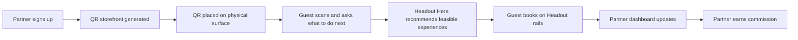
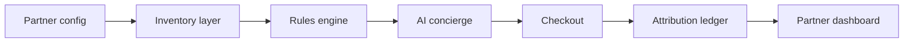
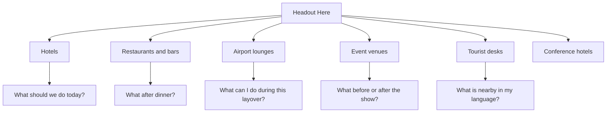

# Headout Here - Master Handoff

Generated: 2026-06-18  
Project: Hackin 2026 idea development  
Working name: **Headout Here**

---

## Executive Summary

**Headout Here turns trusted physical places into Headout-powered experience storefronts.**

Hotels, restaurants, airport lounges, event venues, conference hotels, theatres, cruise terminals, tourist desks, and other high-footfall partners get a branded QR concierge. Guests scan, ask what to do next, book through Headout, and the partner earns a cut from every QR-attributed booking.

This is not only a distribution idea. It is also a brand-positioning play:

> Headout becomes the helpful answer to "what should we do next?" wherever that question is asked in the real world.

---

## Source Docs

Use these as the canonical artifacts from this session:

- [Hackin 2026 Ideas.md](Hackin%202026%20Ideas.md) - original idea log and broader Hackin notes.
- [Hackin 2026 Better Ideas.md](Hackin%202026%20Better%20Ideas.md) - idea shortlist after reading Slack context.
- [Hackin 2026 - Experiences Launchpad.md](Hackin%202026%20-%20Experiences%20Launchpad.md) - main product brief for the Launchpad/Headout Here idea.
- [Hackin 2026 - Experiences Launchpad.html](Hackin%202026%20-%20Experiences%20Launchpad.html) - readable HTML one-pager with flow diagrams.
- [Headout Here - GTM Plan.md](Headout%20Here%20-%20GTM%20Plan.md) - go-to-market plan.
- [Headout Here - Master Handoff.md](Headout%20Here%20-%20Master%20Handoff.md) - this handoff.

---

## Session Context

The work began from [Hackin 2026 Ideas.md](Hackin%202026%20Ideas.md), which contained a broad list of Hackin ideas. The user had registered a Hackin team and initially had **TripBrain/Noma** in scope.

Slack context was gathered from:

- `#event-hackin-2026-ideas`
- `#pod-partnerships`

Key conclusions from Slack/context:

- `#event-hackin-2026-ideas` showed crowded lanes around AI travel planning, maps, discovery, Dex/gamification, reel ingestion, Synthetic Guest Lab, and Complete Your Day.
- Several existing ideas from the original note had collision risk or were already claimed.
- `#pod-partnerships` showed Headout already has serious existing machinery around digital distribution, creators, affiliates, API partners, partner portals, voucher APIs, whitelabel, and reporting.
- Therefore, Headout Here should **not** be framed as a creator storefront, travel-agent tool, generic affiliate tool, or API-partner feature.
- The stronger wedge is **physical-context partners** who have traveler intent but no experiences infrastructure.

---

## Product Name

Recommended name:

## Headout Here

Why this name works:

- It is broad enough for hotels, restaurants, lounges, venues, tourist desks, cruise terminals, and conference hotels.
- It signals physical context: Headout appears **here**, where the guest already is.
- It does not constrain the idea to QR, partners, hotels, AI, or distribution.
- It supports the brand thesis: Headout becomes present in real-world decision moments.

Tagline:

> **Headout Here turns any trusted place into a launchpad for unforgettable experiences.**

Other names considered:

- Here by Headout
- Headout Places
- Headout Now
- Headout Local
- Headout Anywhere

Final recommendation: **Headout Here**.

---

## One-Line Pitch

**Headout Here turns trusted physical places like hotels, restaurants, airport lounges, event venues, and tourist desks into Headout-powered experience storefronts: guests scan a QR, ask what to do next, book instantly, and the partner earns a cut.**

---

## Sharp Pitch

Travelers often decide what to do while they are already in the city: at a hotel desk, after dinner, during a lounge delay, before a concert, or at a tourist counter.

These places have trust and footfall, but they do not have live inventory, checkout, fulfillment, support, or payments. Headout does.

Headout Here gives every partner a branded QR concierge. Guests scan, ask naturally, get curated Headout experiences based on location, time, weather, language, and constraints, then book on Headout rails. Every QR is attributed, so partners earn commission from bookings they drive.

This is a new physical distribution network and a brand-positioning play: Headout becomes the helpful answer to "what should we do next?" in the real world.

---

## Core Product Loop

1. Partner signs up.
2. Partner selects type, location, brand tone, languages, and QR surfaces.
3. Headout Here generates a branded mobile storefront and QR assets.
4. Guest scans from a physical surface.
5. Guest asks what to do next.
6. Concierge recommends feasible, bookable Headout experiences.
7. Guest books through Headout.
8. Booking is attributed to the partner QR.
9. Partner dashboard updates with scans, chats, bookings, GMV, and commission.
10. Partner receives payout for completed QR-attributed bookings.

---

## Target Partner Surfaces

| Partner Type | Use Case | Best QR Surfaces | Partner Value |
|---|---|---|---|
| Hotels | "What should we do today?" | lobby stand, room card, WiFi page, pre-arrival email | concierge revenue without staffing |
| Restaurants/bars | "What should we do after dinner?" | table tent, bill folder, receipt, host stand | monetize post-meal intent |
| Airport/airline lounges | layovers, delays, early arrivals | lounge table, reception desk, captive portal | ancillary revenue and better passenger experience |
| Event venues/theatres | pre/post-show plans | venue screens, ticket email, lobby poster, exit signage | extend event into a city itinerary |
| Conference hotels/venues | attendee after-hours plans | event app, registration desk, hotel lobby | better attendee experience |
| Cruise/ferry terminals | shore time and waiting time | terminal poster, boarding area, info desk | monetize idle time |
| Tourist info desks | modern replacement for brochures | counter sign, staff handout, city map QR | multilingual local recommendations |

---

## Partner Economics

Partner earns a commission from bookings attributed to its QR.

Suggested pilot commission:

| Partner Type | Suggested Cut |
|---|---:|
| Hotels | 8-10% |
| Restaurants/bars | 5-8% |
| Airport/lounge operators | negotiated rev share |
| Conference/event venues | rev share or sponsor model |
| Tourist desks | 5-10% |

Attribution model:

- every QR is tied to partner, location, and surface
- scan creates partner/session attribution
- booking within attribution window credits the partner
- partner earns only on completed bookings
- dashboard breaks down performance by QR surface

Suggested attribution windows:

- same-session default
- 7 days for hotel pre-arrival / room QR
- same-day for restaurants, lounges, tourist desks, and event venues

---

## Why Headout Should Care

Distribution:

- low-CAC bookings
- partner-led demand outside existing creator/affiliate/API lanes
- contextual acquisition at the moment of physical intent
- incremental demand from users who may not open Headout first
- measurable QR-to-booking funnel

Brand positioning:

- Headout shows up in trusted physical environments.
- Every QR is an offline brand placement with measurable revenue.
- Headout becomes a concierge-like helper, not only a checkout destination.
- Partners lend local trust to Headout in moments where guests need guidance.
- The brand claim becomes: **Headout is here when you ask what to do next.**

Data moat:

- Headout learns which physical contexts convert which experiences.
- The system can optimize QR placement, recommendation themes, partner category, city, time of day, and intent prompt.

---

## Why Partners Should Care

Partners get:

- new revenue without operating tours
- better guest experience
- multilingual concierge without staffing
- no inventory, support, payment, or fulfillment burden
- branded experience rather than generic affiliate link
- dashboard for scans, chats, bookings, GMV, conversion, and commission

Core partner message:

> Your guests already ask what to do next. Headout Here turns that question into revenue.

---

## Demo Story

Recommended Hackin demo path:

1. Start with **Casa Aurelia Rome Hotel** as the first partner.
2. Hotel manager signs up.
3. They enter:
   - partner type: hotel
   - location: near Vatican City
   - guest mix: Japanese, English, Hindi
   - tone: calm, premium, family-friendly
   - commission: 8%
4. Headout Here generates:
   - lobby QR
   - mobile storefront
   - AI concierge
   - curated Rome inventory
   - partner dashboard
5. Judge scans the QR.
6. Guest asks:

> "It is raining and we have a 6-year-old. What can we do this afternoon?"

7. Concierge recommends indoor, nearby, available, family-friendly experiences.
8. Guest books.
9. Partner dashboard updates with booking, GMV, and commission.
10. Reveal: change partner type to restaurant, airport lounge, or event venue. Same engine, different physical intent.

Demo close:

> The hotel demo is one wedge. Headout Here is the platform. Any trusted physical surface can launch an experiences business on Headout rails, earn a cut from QR-attributed bookings, and put Headout in front of guests at the exact moment they need plans.

---

## Flow Diagrams

### Product Loop

### System Flow

### Physical Surface Expansion

---

## 42-Hour Hackin Build Scope

Keep the prototype focused:

> Partner signup -> generated QR/storefront -> guest concierge -> booking -> QR-attributed commission dashboard.

Build for real:

- partner setup form
- generated guest storefront
- AI concierge over inventory JSON
- QR code
- mocked booking action
- dashboard metrics update
- partner type switcher

Fake cleanly:

- real payment
- real ticket fulfillment
- real partner auth
- real commission settlement
- live inventory API
- multi-city supply

MVP data:

- one city: Rome
- 30-50 experiences
- realistic partner config
- mocked weather
- mocked booking ledger
- mocked commission dashboard

Screens:

1. Partner setup
2. Generated QR/storefront preview
3. Guest mobile concierge
4. Recommendations
5. Mock checkout/confirmation
6. Partner dashboard
7. Partner type reveal: hotel -> restaurant -> lounge -> event venue

---

## GTM Summary

Canonical GTM doc: [Headout Here - GTM Plan.md](Headout%20Here%20-%20GTM%20Plan.md)

Recommended GTM framing:

> Launch city-by-city as a physical partner network.

Beachhead:

- Rome

Why Rome:

- dense tourist geography
- strong Headout inventory fit
- lots of hotel/restaurant surfaces
- high "what do we do now?" behavior
- easy to demonstrate Vatican/Colosseum use cases

GTM phases:

1. **Internal validation:** curate Rome inventory, build QR attribution, test flows.
2. **Concierge hotel pilot:** onboard 10-20 Rome hotels.
3. **Surface expansion:** add restaurants, lounge, event venue, tourist desk.
4. **City playbook:** package rollout for Dubai, London, Paris, Barcelona.

North star:

> Incremental QR-attributed GMV from physical partner surfaces.

Key metrics:

- partners signed
- QR surfaces live
- scans per QR
- scan-to-chat rate
- scan-to-booking rate
- GMV per scan
- partner commission earned
- partner retention
- guest feedback
- direct Headout return visits

---

## Key Differentiation

Not a generic affiliate link:

- affiliate link is static
- Headout Here is contextual, partner-branded, concierge-led, inventory-aware, and QR-attributed

Not a hotel chatbot:

- hotels are one demo wedge
- platform supports multiple physical surfaces

Not just distribution:

- it creates offline brand presence
- each QR is both a booking surface and a brand placement

Not a creator/travel-agent tool:

- those overlap with existing partner/affiliate work in `#pod-partnerships`
- this focuses on physical-context partners with footfall and immediate intent

---

## Risks and Mitigations

| Risk | Mitigation |
|---|---|
| QR scans are low | test multiple surfaces and CTAs; show partners missed revenue |
| Partners do not place QR prominently | provide physical collateral and first-week activation check |
| Recommendations are infeasible | deterministic checks before AI wording |
| Looks like affiliate links | lead with concierge, local context, fulfillment, support, and brand presence |
| Too hotel-specific | demo hotel, then immediately reveal restaurant/lounge/venue variants |
| Partner payout disputes | transparent attribution window and dashboard |
| Brand gets hidden behind partner | visible "Powered by Headout Here" on every surface |
| Too broad for Hackin | build one polished flow, use partner type switcher for breadth |

---

## Important Decisions Made

1. Name selected: **Headout Here**.
2. Product should stay multi-partner, not hotel-only.
3. Hotels are acceptable as easiest demo path, not product boundary.
4. Creators/travel agents should be avoided in framing because existing distribution/affiliate work already covers adjacent lanes.
5. Partner/distributor must receive a cut from bookings made through their QR.
6. QR attribution and partner dashboard are core, not optional.
7. The idea must be framed as distribution **and** brand positioning.
8. Rome is the recommended launch/demo city.

---

## Recommended Next Steps For New Project

### Product

- Decide first demo partner: hotel, restaurant, lounge, or event venue.
- Keep partner type switcher in demo to avoid hotel-only perception.
- Build one Rome inventory JSON with enough variety for realistic recommendations.
- Make QR attribution visible in the dashboard.
- Add "Powered by Headout Here" brand treatment to every guest surface.

### Design

- Create visual identities for:
  - hotel lobby stand
  - restaurant table tent
  - lounge placard
  - event venue poster
- Design mobile-first guest flow.
- Design dashboard around scans -> chats -> bookings -> commission.

### Engineering

- Frontend:
  - partner setup
  - generated storefront
  - mobile concierge
  - dashboard
  - partner type switcher
- Backend/mock:
  - partner config JSON
  - inventory JSON
  - deterministic filters
  - booking simulator
  - attribution ledger
  - commission calculation
- AI:
  - grounded concierge prompt
  - language support
  - explanation for why recommendation fits

### Pitch

- Open with the real-world behavior:

> "Every day, travelers ask 'what should we do next?' at hotel desks, restaurant tables, lounges, venues, and tourist counters."

- Show booking and commission dashboard.
- Reveal multi-partner platform.
- Close on brand positioning:

> "Headout Here makes every trusted place in a city a doorway into Headout."

---

## Short Pitch For Reuse

**Headout Here turns trusted physical places into Headout-powered experience storefronts.** Hotels, restaurants, airport lounges, event venues, and tourist desks get a branded QR concierge. Guests scan, ask what to do next, book through Headout, and the partner earns a cut from every QR-attributed booking.

This gives Headout low-CAC physical distribution, measurable offline brand presence, and a new way to be discovered at the exact moment travelers need plans.

---

## Current Artifact Status

Completed:

- idea shortlist from Slack + original notes
- dedicated product brief
- readable HTML one-pager with flow diagrams
- GTM plan
- master handoff

Files:

- [Hackin 2026 Ideas.md](Hackin%202026%20Ideas.md)
- [Hackin 2026 Better Ideas.md](Hackin%202026%20Better%20Ideas.md)
- [Hackin 2026 - Experiences Launchpad.md](Hackin%202026%20-%20Experiences%20Launchpad.md)
- [Hackin 2026 - Experiences Launchpad.html](Hackin%202026%20-%20Experiences%20Launchpad.html)
- [Headout Here - GTM Plan.md](Headout%20Here%20-%20GTM%20Plan.md)
- [Headout Here - Master Handoff.md](Headout%20Here%20-%20Master%20Handoff.md)
