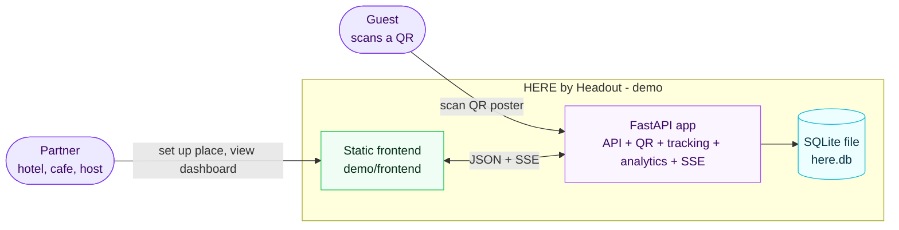
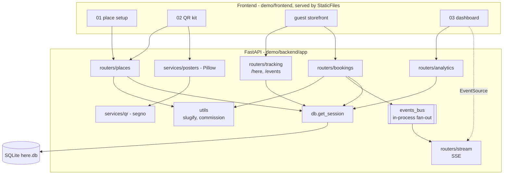
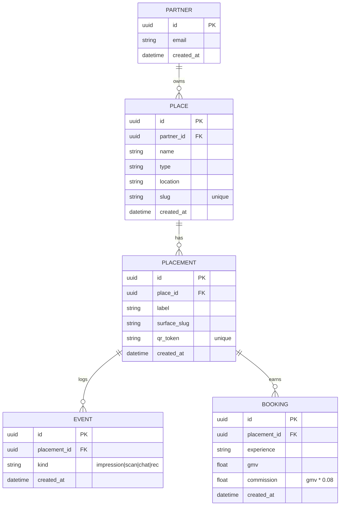
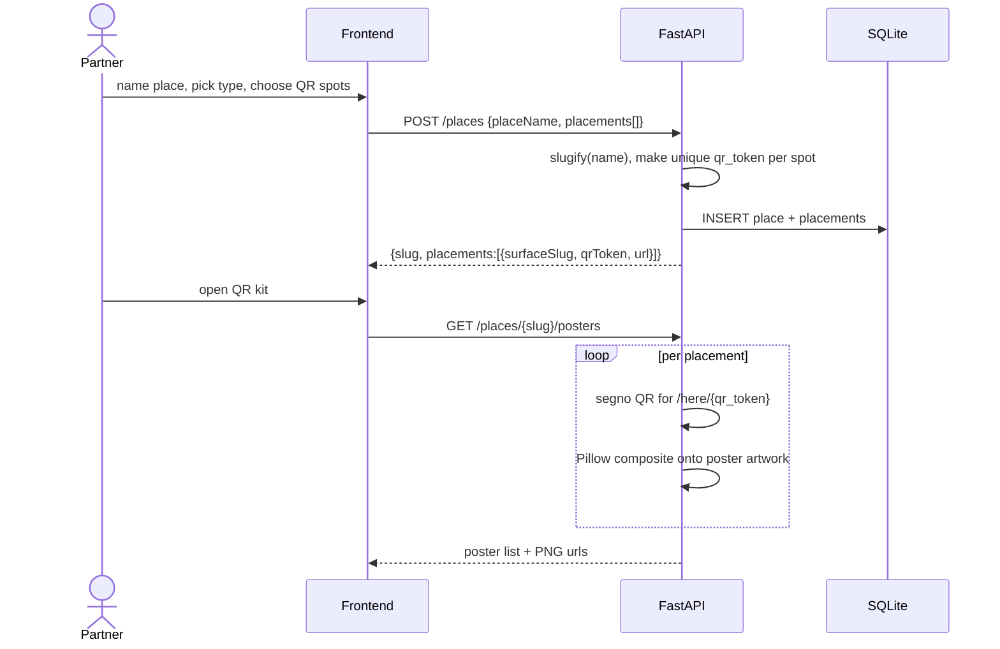
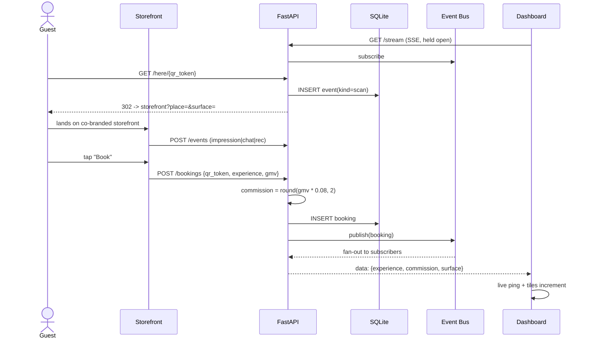
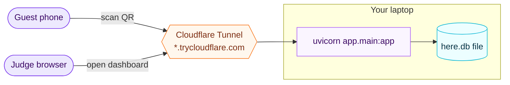
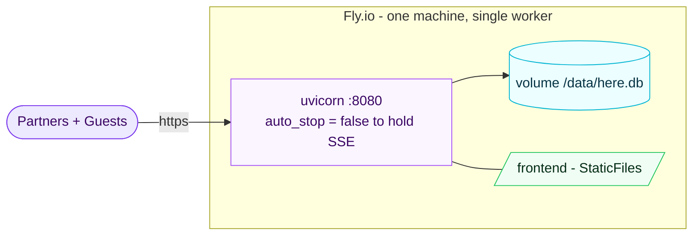
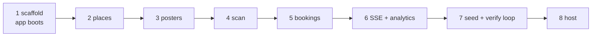

# HERE by Headout — Architecture

Diagrams for the partner-flow demo backend (FastAPI + SQLite + SSE). All diagrams are
Mermaid and render inline on GitHub. See `MASTER_PLAN.md` for the written plan and
`TESTING.md` for the contract these diagrams implement.

## 1. System context

Who uses it and what it talks to. One process, one file — no external services.



## 2. Components

Inside the FastAPI process. The SSE bus is a plain in-process asyncio fan-out (single
worker), so "live" needs no Redis and no replication.



## 3. Data model



The dashboard funnel is `GROUP BY placement_id` over `EVENT` + `BOOKING` — the hardcoded
`surfaceData` object in the prototype collapses into one query.

## 4. Key flows

### 4a. Partner setup → QR kit (screens 01 → 02)



### 4b. The money loop: scan → book → live dashboard

This is the demo. A scan is attributed by `qr_token`; a booking publishes to the SSE bus
and lands on the dashboard with no refresh.



### 4c. Analytics aggregation (screen 03)

```mermaid
sequenceDiagram
    participant DASH as Dashboard
    participant API as FastAPI
    participant DB as SQLite

    DASH->>API: GET /analytics/{slug}
    API->>DB: SELECT events GROUP BY placement, kind
    API->>DB: SELECT bookings GROUP BY placement
    API->>API: per-surface rows + totals; conversion = bookings/scans
    API-->>DASH: {totals, surfaces[]}
```

## 5. Deployment topology

### 5a. Demo — local + Cloudflare Tunnel ($0, nothing deployed)



### 5b. Durable — Fly.io + volume



> Single worker is deliberate: the SSE fan-out is in-process. Scaling to multiple
> machines/workers would need a shared bus (e.g. Redis pub/sub) — out of scope for the
> hackathon, noted here so the constraint is explicit.

## 6. Build = test milestones



Each box has a matching test group in `tests/` (see `TESTING.md`) — build until it's green.
